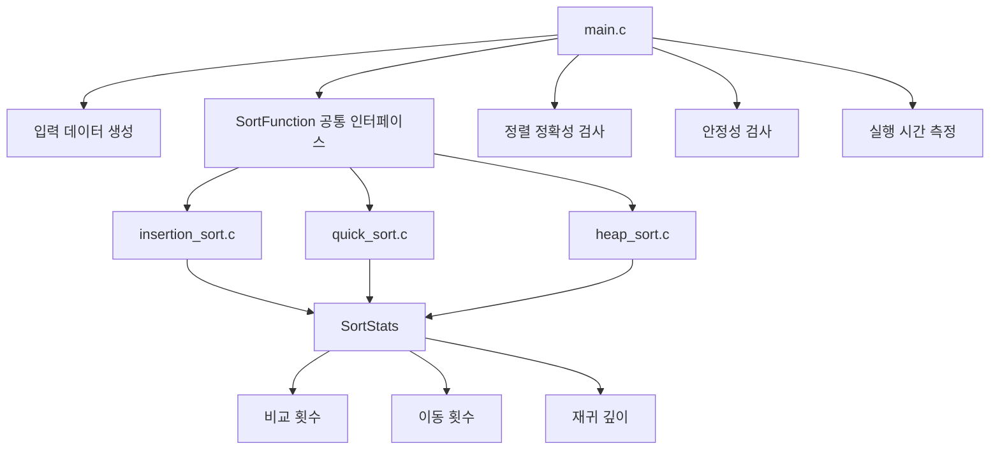
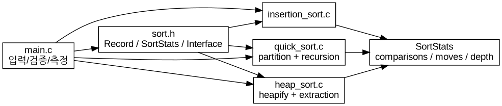
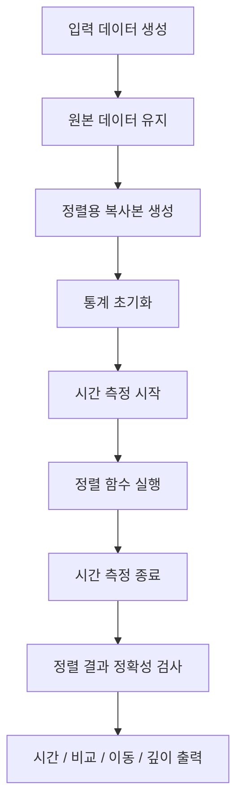
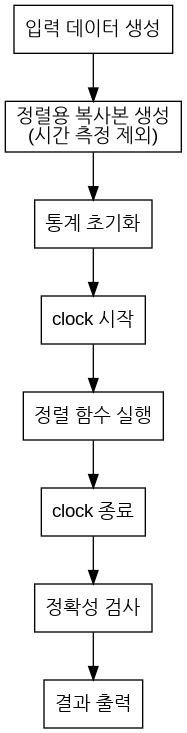
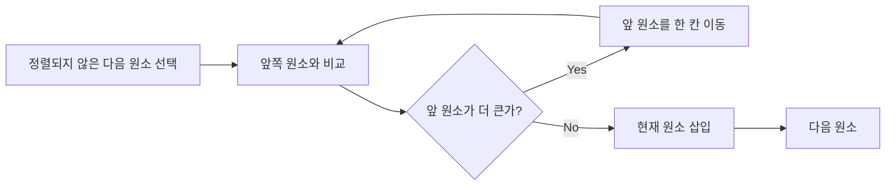
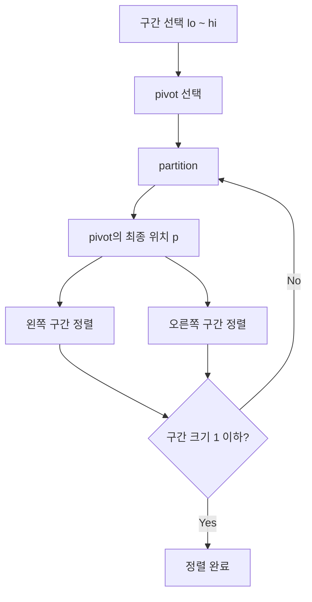
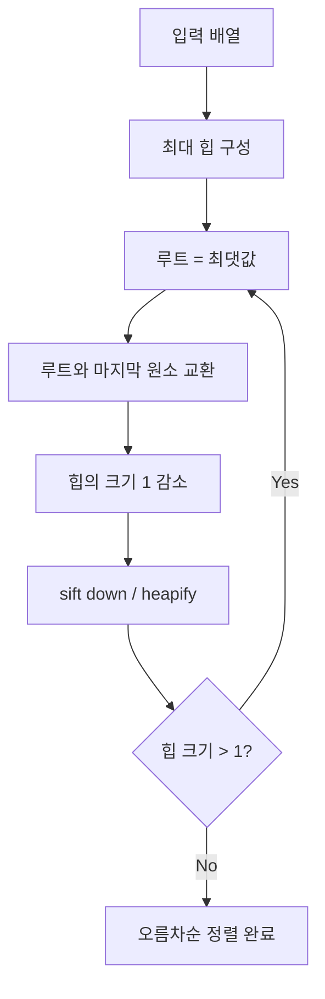

# 알고리즘 비교 실험 보고서

## 0. 실험 개요

### 0.1 주제

**삽입 정렬(Insertion Sort), 퀵 정렬(Quick Sort), 힙 정렬(Heap Sort)의 비교**

- 삽입 정렬: 수업에서 학습한 정렬 알고리즘
- 퀵 정렬: 수업에서 학습한 분할 기반 알고리즘의 `partition` 구조를 이용해 구현
- 힙 정렬: 수업에서 다루지 않은 알고리즘으로 선정하고 AI를 통해 원리를 학습

세 알고리즘은 모두 비교 기반 정렬이지만, 시간복잡도, 안정성, 이동 횟수, 추가 메모리, 입력 데이터에 따른 성능 변화에서 차이를 보인다. 따라서 동일한 측정 기준을 적용하여 알고리즘의 특징을 비교하고자 한다.

> **주의:** 아래의 실행 시간은 특정 실행 환경에서 얻은 예시 측정값이다. 제출 전 본인의 환경에서 프로그램을 다시 실행하여 시간 값을 갱신하는 것을 권장한다. 비교 횟수와 이동 횟수는 동일한 코드와 동일한 입력을 사용하면 재현 가능하다.

---

# 1. 코드 보고서

## 1.1 전체 파일 구조

```text
hw1/
├── src/
│   ├── sort.h
│   ├── insertion_sort.c
│   ├── quick_sort.c
│   ├── heap_sort.c
│   └── main.c
│
├── report/
│   └── REPORT.md
│
└── README.md
```

### 파일별 역할

| 파일 | 역할 |
|---|---|
| `sort.h` | `Record`, `SortStats`, 정렬 함수 포인터 및 공통 측정 함수 정의 |
| `insertion_sort.c` | 삽입 정렬 구현 |
| `quick_sort.c` | `partition`을 이용한 퀵 정렬 구현 |
| `heap_sort.c` | 최대 힙 기반 힙 정렬 구현 |
| `main.c` | 입력 생성, 정확성/안정성 검증, 시간·비교·이동 횟수 측정 |
| `REPORT.md` | 알고리즘 원리와 실험 결과 정리 |

### 구조도





---

## 1.2 공통 자료 구조와 인터페이스

세 알고리즘을 동일한 조건에서 비교하기 위해 모든 입력 데이터를 다음과 같은 `Record` 구조체로 표현하였다.

```c
typedef struct {
    int key;
    int id;
} Record;
```

- `key`: 실제 정렬 기준
- `id`: 입력 당시의 순서를 기록하기 위한 값

`id`를 별도로 저장한 이유는 **안정성(stability)** 을 실험하기 위해서이다. 두 레코드의 `key`가 같을 때 정렬 전후의 `id` 순서가 유지되면 안정 정렬로 판단한다.

세 정렬 함수는 다음과 같은 동일한 형태를 사용한다.

```c
typedef void (*SortFunction)(Record *a, int n, SortStats *stats);
```

따라서 `main.c`는 정렬 알고리즘의 내부 구현을 알 필요 없이 동일한 방식으로 세 알고리즘을 호출할 수 있다.

---

## 1.3 측정 지표

수업에서 중요하게 다룬 비교 횟수와 이동 횟수를 포함하여 다음 항목을 측정하였다.

| 지표 | 측정 방법 |
|---|---|
| 실행 시간 | 정렬 함수 호출 직전과 직후의 CPU 시간을 측정 |
| 비교 횟수 | 두 `Record`의 `key`를 비교할 때마다 1회 증가 |
| 이동 횟수 | `Record` 하나의 대입이 발생할 때마다 1회 증가 |
| 정확성 | 정렬 후 모든 인접 원소가 오름차순인지 검사 |
| 안정성 | 같은 `key`를 가진 레코드의 `id` 순서가 유지되는지 검사 |
| 재귀 깊이 | 퀵 정렬의 재귀 호출 깊이를 기록 |

특히 이동 횟수는 알고리즘마다 `swap`의 구현 방식이 달라질 수 있으므로, 본 실험에서는 **`Record` 하나의 대입을 1 move로 정의**하였다. 따라서 일반적인 3단계 swap은 3 moves로 계산된다.

---

## 1.4 `main.c`의 실험 설계상 처리

실험 결과의 공정성을 위해 입력 데이터 복사는 측정 시간에 포함하지 않았다.

```text
입력 생성
   ↓
원본 입력 보관
   ↓
복사본 생성 ───────────────┐
   ↓                       │ 시간 측정 제외
통계 초기화                │
   ↓                       │
clock() 시작               │
   ↓                       │
정렬 알고리즘 실행          │
   ↓                       │
clock() 종료                │
   ↓                       │
정확성 검사 및 결과 출력     │
```





### 반복 측정

동일한 입력에 대해 각 알고리즘을 **3회 반복**하여 실행 시간을 평균하였다. 입력 복사 및 결과 검사는 시간 측정 구간 밖에서 수행하였다.

---

## 1.5 정확성 및 안정성 검증

### 정확성

정렬 후 다음 조건을 모든 인접 원소에 대해 확인하였다.

```text
key[i-1] <= key[i]
```

또한 입력 크기 0, 1, 2, 10, 100에 대해 별도의 정확성 테스트를 수행하였다.

### 안정성

다음과 같이 동일한 `key`를 가진 여러 레코드를 생성하였다.

```text
(key=2, id=0)
(key=1, id=1)
(key=2, id=2)
(key=1, id=3)
```

정렬 후 `key=1`인 원소의 `id`가 `1 → 3`, `key=2`인 원소의 `id`가 `0 → 2`와 같이 원래 순서를 유지하면 안정적인 것으로 판단한다.

한 번의 입력에서 우연히 안정적으로 보이는 것을 방지하기 위해 동일한 방식의 중복 키 데이터를 여러 번 생성하여 안정성을 확인하였다.

---

# 2. 알고리즘 상세

## 2.1 삽입 정렬

삽입 정렬은 배열의 앞부분을 이미 정렬된 부분으로 보고, 다음 원소를 그 위치에 삽입하는 방식이다.



### 핵심 특징

- 최선의 경우: `O(n)`
- 평균/최악의 경우: `O(n²)`
- 추가 배열 공간: `O(1)`
- 안정성: **안정적**
- 이미 정렬된 데이터에 매우 적은 작업이 필요하다.

이번 구현에서는 `>` 조건으로 원소를 이동시키므로 같은 `key`를 가진 원소의 상대적인 순서를 바꾸지 않는다.

---

## 2.2 퀵 정렬

퀵 정렬은 `partition`을 이용하여 pivot을 기준으로 작은 값과 큰 값을 나눈 후 양쪽 구간을 재귀적으로 정렬한다.

강의안에는 다음과 같은 **Quick Selection** 코드가 제시되었다.

```c
int quickSelection(int a[], int n, int k,
                   int *comparisons,
                   int *moves) {
    int lo = 0;
    int hi = n - 1;
    while (1) {
        int p = partition(a, lo, hi,
                          comparisons, moves);
        if (p == k - 1) {
            return a[p];
        }
        if (p > k - 1) {
            hi = p - 1;
        } else {
            lo = p + 1;
        }
    }
}
```

여기서 중요한 점은 **Quick Selection과 Quick Sort는 같은 알고리즘이 아니라는 것**이다.

- Quick Selection: `partition` 후 `k`번째 원소가 포함된 한쪽만 계속 탐색한다.
- Quick Sort: `partition` 후 왼쪽과 오른쪽의 두 구간을 모두 재귀적으로 정렬한다.

따라서 이번 구현에서는 강의에서 학습한 `partition`, 비교 횟수, 이동 횟수의 측정 방식을 참고하되, 양쪽 구간을 모두 재귀적으로 처리하여 전체 배열을 정렬하였다.



이번 구현에서는 **구간의 마지막 원소를 pivot으로 선택**하였다. 따라서 이미 정렬되었거나 역순으로 정렬된 입력에서는 pivot이 계속 한쪽 끝에 위치하여 최악의 경우 `O(n²)`가 발생할 수 있다.

### 핵심 특징

- 최선의 경우: `O(n log n)`
- 평균적인 경우: `O(n log n)`
- 최악의 경우: `O(n²)`
- 재귀 스택: 평균적으로 `O(log n)`, 최악의 경우 `O(n)`
- 일반적인 in-place 구현에서는 안정적이지 않다.

---

## 2.3 힙 정렬 — AI를 통해 학습한 알고리즘

힙 정렬은 **완전 이진 트리 형태의 힙(heap)** 자료구조를 이용하는 비교 기반 정렬 알고리즘이다. 최대 힙을 만들면 루트에 현재 구간의 최댓값이 위치한다. 이후 루트와 마지막 원소를 교환하고 남은 구간에 대해 다시 heapify를 수행한다. citehttps://en.wikipedia.org/wiki/Heapsort

### 최대 힙의 조건

부모 노드의 `key`가 자식 노드보다 크거나 같으면 최대 힙이다.

```text
          9
        /   \
       7     8
      / \   / \
     3   4 2   6
```

배열로 저장하면 다음과 같이 표현할 수 있다.

```text
parent = (i - 1) / 2
left   = 2i + 1
right  = 2i + 2
```

### 힙 정렬 과정



힙을 구성하는 단계는 전체적으로 `O(n)`이고, 최댓값을 하나씩 꺼내는 과정이 `n`번 반복되며 각 단계에서 최대 `O(log n)`의 heapify가 필요하므로 전체 시간복잡도는 `O(n log n)`이다. 추가 배열 공간은 `O(1)`이며, 일반적인 힙 정렬은 안정적이지 않다. citehttps://en.wikipedia.org/wiki/Heapsort

### AI 학습에서 이해한 핵심

힙 정렬을 처음 접했을 때 중요한 부분은 **정렬을 위해 매번 전체 배열을 탐색하는 대신, 힙의 구조를 이용해 최댓값을 빠르게 찾는다는 점**이다.

선택 정렬에서는 최댓값 또는 최솟값을 찾기 위해 매 단계에서 남은 배열을 탐색해야 하지만, 힙 정렬은 최대 힙의 루트에 최댓값을 유지한다. 따라서 최댓값을 선택하는 과정과 배열의 위치를 확정하는 과정을 효율적으로 반복할 수 있다.

---

# 3. 알고리즘별 이론적 비교

| 항목 | 삽입 정렬 | 퀵 정렬 | 힙 정렬 |
|---|---:|---:|---:|
| 최선 | `O(n)` | `O(n log n)` | `O(n log n)` |
| 평균 | `O(n²)` | `O(n log n)` | `O(n log n)` |
| 최악 | `O(n²)` | `O(n²)` | `O(n log n)` |
| 추가 공간 | `O(1)` | 평균 `O(log n)`, 최악 `O(n)` | `O(1)` |
| 안정성 | O | X | X |
| 주요 아이디어 | 이미 정렬된 부분에 삽입 | pivot으로 분할 | heap에서 최댓값 추출 |

힙 정렬과 퀵 정렬은 모두 평균적인 정렬 성능이 `O(n log n)` 수준이지만, 이번 퀵 정렬 구현은 마지막 원소를 pivot으로 선택하기 때문에 특정 입력에서는 `O(n²)`까지 성능이 악화될 수 있다. 반면 힙 정렬은 최악의 경우에도 `O(n log n)`의 시간복잡도를 유지한다. citehttps://en.wikipedia.org/wiki/Sorting_algorithmhttps://en.wikipedia.org/wiki/Heapsort

---

# 4. 알고리즘 실험

## 4.1 실험 조건

| 항목 | 설정 |
|---|---|
| 알고리즘 | Insertion / Quick / Heap |
| 기본 입력 크기 | `n = 5000` |
| 반복 횟수 | 3회 |
| 정렬 기준 | `key` 오름차순 |
| 측정 시간 | 정렬 함수 실행 시간만 측정 |
| 입력 복사 | 시간 측정에서 제외 |
| 비교 횟수 | `key` 비교 1회당 +1 |
| 이동 횟수 | `Record` 대입 1회당 +1 |
| 안정성 | 동일 key의 id 순서 확인 |
| 입력 유형 | random / sorted / reverse / duplicates |

입력 유형을 네 가지로 나눈 이유는 단순한 무작위 데이터뿐 아니라 알고리즘의 **입력 형태에 대한 민감도**를 확인하기 위해서이다.

- `random`: 일반적인 무작위 입력
- `sorted`: 이미 오름차순인 입력
- `reverse`: 완전히 역순인 입력
- `duplicates`: 동일한 key가 많이 존재하는 입력

---

## 4.2 실험 결과

아래 결과는 `gcc -std=c17 -Wall -Wextra -O2`로 컴파일한 실행에서 얻은 값이다. 실행 시간은 CPU와 시스템 상태에 따라 달라질 수 있으므로, 제출 전 재실행하여 갱신한다.

### 정확성 및 안정성

| 알고리즘 | 정렬 정확성 | 경험적 안정성 테스트 |
|---|---|---|
| Insertion | PASS | PASS |
| Quick | PASS | FAIL |
| Heap | PASS | FAIL |

`FAIL`은 정렬 실패를 의미하지 않는다. 여기서 안정성 테스트의 `FAIL`은 **같은 key를 가진 레코드의 원래 순서가 바뀌었다**는 의미이다.

### 성능 측정

| Algorithm | Input | Time (ms) | Comparisons | Moves | Correct | Depth |
|---|---|---:|---:|---:|---|---:|
| Insertion | random | 4.030 | 6,146,080 | 6,146,075 | PASS | 0 |
| Quick | random | 0.258 | 70,679 | 102,987 | PASS | 26 |
| Heap | random | 0.577 | 107,710 | 171,372 | PASS | 0 |
| Insertion | sorted | 0.002 | 4,999 | 0 | PASS | 0 |
| Quick | sorted | 11.586 | 12,497,500 | 4,999 | PASS | 4,999 |
| Heap | sorted | 0.480 | 112,126 | 182,796 | PASS | 0 |
| Insertion | reverse | 9.352 | 12,502,499 | 12,507,498 | PASS | 0 |
| Quick | reverse | 11.600 | 12,497,500 | 12,499 | PASS | 4,999 |
| Heap | reverse | 0.467 | 103,227 | 160,308 | PASS | 0 |
| Insertion | duplicates | 4.901 | 5,854,762 | 5,854,525 | PASS | 0 |
| Quick | duplicates | 0.592 | 649,863 | 50,889 | PASS | 279 |
| Heap | duplicates | 0.425 | 104,656 | 164,667 | PASS | 0 |

---

# 5. 실험 결과 분석

## 5.1 삽입 정렬

삽입 정렬은 이미 정렬된 입력에서 매우 적은 비교와 이동만 수행하였다. 실제 실험에서도 `sorted` 입력에서 비교 횟수는 `4,999`, 이동 횟수는 `0`으로 나타났다. 이는 삽입 정렬이 입력이 거의 정렬되어 있을 때 효율적으로 동작한다는 특성과 일치한다.

반면 `reverse` 입력에서는 각 원소를 여러 위치 뒤로 이동해야 하기 때문에 비교와 이동 횟수가 크게 증가하였다. 따라서 입력 형태에 따른 성능 차이가 세 알고리즘 중 가장 직접적으로 나타났다.

또한 삽입 정렬은 동일한 key에 대해 기존 원소보다 **엄격하게 큰 경우에만 이동**시키므로 안정성을 유지한다.

---

## 5.2 퀵 정렬

무작위 입력에서는 약 `70,679`회의 비교로 정렬되어 다른 두 알고리즘보다 적은 비교 횟수를 보였다. 재귀 깊이도 `26`으로 나타났다.

그러나 `sorted`와 `reverse` 입력에서는 각각 약 `1,250만`회의 비교가 발생하고 재귀 깊이가 `4,999`까지 증가하였다. 이는 이번 구현에서 항상 마지막 원소를 pivot으로 선택했기 때문이다.

즉, 퀵 정렬의 성능은 **알고리즘 자체뿐 아니라 pivot 선택 방법과 입력 데이터의 관계**에 크게 영향을 받는다.

특히 `sorted` 입력에서는 비교 횟수가 매우 많았지만 이동 횟수는 상대적으로 작았다. 이는 비교 횟수와 이동 횟수가 서로 다른 비용 지표임을 보여준다.

---

## 5.3 힙 정렬

힙 정렬은 네 가지 입력 유형에서 모두 `O(n log n)` 수준의 비교 횟수를 유지하였다. 특히 `sorted`와 `reverse` 입력에서도 퀵 정렬처럼 비교 횟수가 `O(n²)` 수준으로 증가하지 않았다.

대신 이번 측정에서는 퀵 정렬보다 이동 횟수가 많은 경우가 나타났다. 이는 힙 정렬이 최대 힙을 유지하기 위해 여러 번의 swap과 sift-down을 수행하기 때문이다.

따라서 힙 정렬은 **최악의 경우에도 일정한 시간복잡도를 보장하면서 추가 배열 공간을 거의 사용하지 않는다는 특징**을 가진다. 반면 안정성을 제공하지 않는다는 점은 삽입 정렬과의 중요한 차이이다. citehttps://en.wikipedia.org/wiki/Heapsort

---

# 6. 세 알고리즘의 종합 비교

```mermaid
flowchart LR
    I[삽입 정렬\nO(n²) 평균\n안정적\nO(1) 추가 공간]
    Q[퀵 정렬\nO(n log n) 평균\n최악 O(n²)\n재귀 스택 사용]
    H[힙 정렬\nO(n log n) 보장\n불안정\nO(1) 추가 공간]

    I ---|거의 정렬된 입력에 유리| Q
    Q ---|평균적으로 빠르지만 pivot 영향| H
    H ---|최악 시간복잡도 보장| I
```

세 알고리즘은 서로 다른 장점을 가진다.

- 삽입 정렬은 구현이 단순하고 안정적이며 거의 정렬된 데이터에서 효율적이다.
- 퀵 정렬은 평균적으로 빠르지만 pivot 선택에 따라 성능이 크게 달라질 수 있다.
- 힙 정렬은 최악의 경우에도 `O(n log n)`을 유지하며 추가 배열 공간을 거의 사용하지 않지만 안정적이지 않다.

따라서 특정 알고리즘 하나가 모든 조건에서 동일한 특성을 갖는 것이 아니라, **입력 형태, 안정성 요구, 메모리 조건, 최악의 실행시간에 대한 요구에 따라 알고리즘의 특성이 달라진다.**

---

# 7. 한계점 및 개선 방향

이번 실험에서는 세 알고리즘의 기본적인 특성을 비교하기 위해 비교적 단순한 구현을 사용하였다. 특히 퀵 정렬은 마지막 원소를 pivot으로 선택했기 때문에 이미 정렬된 데이터에서 최악의 경우가 쉽게 나타난다.

향후에는 다음과 같은 방법으로 실험을 확장할 수 있다.

1. 퀵 정렬의 pivot 선택을 첫 원소, 가운데 원소, median-of-three 등으로 변경
2. 입력 크기를 `1,000`, `5,000`, `10,000` 등으로 증가시키며 성장률 비교
3. 실행 시간뿐 아니라 비교 횟수와 이동 횟수의 증가율을 그래프로 표현
4. 중복 key의 비율을 단계적으로 변화시키며 안정성 및 성능 비교
5. 힙 정렬과 퀵 정렬의 재귀/스택 사용량을 더 세밀하게 측정

---

# 8. 결론

이번 실험에서는 삽입 정렬, 퀵 정렬, 힙 정렬을 동일한 `Record` 구조와 측정 기준으로 구현하고 비교하였다.

실험을 통해 삽입 정렬은 정렬된 입력에서 매우 적은 작업으로 동작하고 안정성을 유지한다는 점을 확인하였다. 퀵 정렬은 무작위 입력에서 적은 비교 횟수와 낮은 실행 시간을 보였지만, 이번 구현처럼 pivot을 고정하면 특정 입력에서 `O(n²)` 수준으로 성능이 악화될 수 있었다. 힙 정렬은 입력 형태에 관계없이 `O(n log n)`의 시간복잡도를 유지하는 대신 안정성을 제공하지 않고 비교적 많은 이동을 수행하였다.

특히 단순히 실행 시간만 비교하는 것이 아니라 **비교 횟수, 이동 횟수, 안정성, 재귀 깊이, 추가 메모리**를 함께 측정함으로써 각 알고리즘의 동작 방식과 장단점을 더 구체적으로 확인할 수 있었다.

---

# 9. AI를 통한 힙 정렬 학습 내용

## 9.1 AI에게 질문한 내용

> 힙 정렬의 원리를 대학 초급 알고리즘 수업 수준에서 설명해줘. 최대 힙을 이용해 오름차순으로 정렬하는 과정, heapify의 역할, 시간복잡도와 공간복잡도, 안정성까지 설명해줘. 또한 선택 정렬과 비교해서 왜 힙 정렬이 더 효율적인지도 설명해줘.

## 9.2 AI 학습 내용 요약

힙 정렬은 배열을 최대 힙으로 만든 뒤 루트에 있는 최댓값을 배열의 마지막 위치로 이동시키는 과정을 반복한다. 최대 힙은 부모 노드가 자식 노드보다 크거나 같은 조건을 만족하는 완전 이진 트리이다.

정렬 과정은 크게 두 단계이다.

1. 입력 배열을 최대 힙으로 만든다.
2. 루트의 최댓값과 마지막 원소를 교환한 뒤, 힙 크기를 줄이고 `sift down`을 수행한다.

이 과정을 반복하면 최댓값부터 뒤쪽 위치가 확정되므로 전체 배열이 오름차순으로 정렬된다.

힙의 높이가 `O(log n)`이므로 하나의 원소를 아래로 내려 힙 조건을 복구하는 `heapify`는 최대 `O(log n)`이 걸린다. 이를 여러 원소에 대해 반복하기 때문에 전체 정렬 시간은 `O(n log n)`이 된다. 또한 입력 배열 자체에서 힙을 구성하고 정렬하므로 추가 배열 공간은 `O(1)` 수준이다. 일반적인 힙 정렬은 안정 정렬이 아니다. citehttps://en.wikipedia.org/wiki/Heapsort

## 9.3 AI 학습 후 이해한 선택 정렬과의 차이

선택 정렬도 매 단계에서 최댓값 또는 최솟값을 선택한다. 그러나 선택 정렬은 남은 원소를 직접 탐색하여 최댓값을 찾아야 하므로 한 단계의 탐색에 `O(n)`이 필요하다.

힙 정렬에서는 최대 힙의 루트가 항상 최댓값이 되도록 자료구조를 유지한다. 따라서 단순히 전체 배열을 다시 탐색하는 대신 힙 구조를 이용하여 최댓값을 관리할 수 있고, 결과적으로 전체 시간복잡도를 `O(n²)`에서 `O(n log n)`으로 줄일 수 있다.

---

# 10. 참고 자료

1. Wikipedia, **Heapsort**. https://en.wikipedia.org/wiki/Heapsort
2. Wikipedia, **Sorting algorithm**. https://en.wikipedia.org/wiki/Sorting_algorithm
3. 수업 강의자료 — Quick Selection의 `partition`, comparison, move 측정 코드
4. OpenAI ChatGPT — 힙 정렬의 개념 및 동작 원리 학습에 활용
